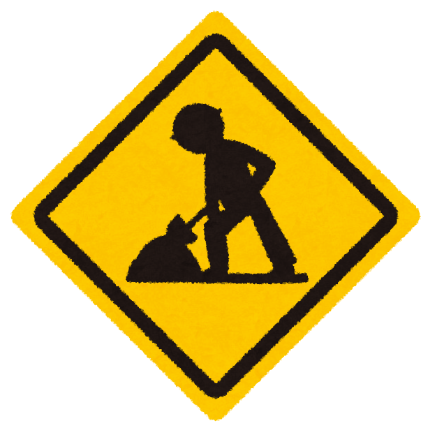

<style type="text/css">
  .reveal .slides section {
    height: 100vh;
    font-size: 20px;
    text-align: left;
    text-transform: none;
  }
  .reveal h1 {
    font-size: 48px;
    text-transform: none;
  }
  .reveal h2 {
    font-size: 36px;
    border-bottom: solid;
    text-transform: none;
  }
  .reveal h3 {
    border-bottom: solid;
    text-transform: none;
  }
  .reveal pre {
    font-size: 10px;
    text-transform: none;
  }
  .reveal .footnote {
    font-size: 15px;
    position: absolute;
    top: 80vh;
  }
</style>

::: { style="position: absolute; top: 30vh; left: 0px" }

# タイトル

#### サブタイトル

:::

---

## セクション

セクションの文章を書く。

### サブセクション

サブセクションの文章を書く。

<div class="footnote">
フッター
</div>

---

::: { style="width:50%; position: absolute; top: 0px; left: 0px" }

## 箇条書きと画像

順序なし箇条書き

- アイテム1
- アイテム2
- アイテム3

順序あり箇条書き

1. アイテム1
2. アイテム2
3. アイテム3
:::

::: { style="width:50%; position: absolute; top: 0px; right: 0px" }
{ style="height: 350px;" }
:::

---

## コードブロック

### Python

```python
def func(i: int) -> int:
  return i
```

### yaml

```yaml
object:
  key: value
  array: [
    1,
    2,
    3,
  ]
```
