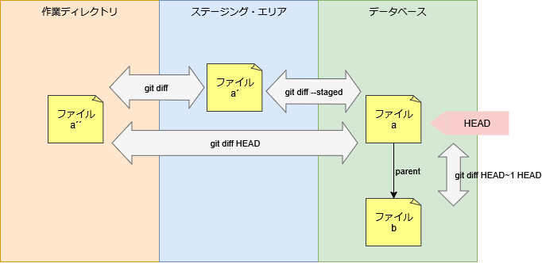

# diff コマンド

差分を表示する。

```sh
git diff
```

## ソースコード

- [builtin/diff.c](https://github.com/git/git/blob/v2.47.1/builtin/diff.c)

## 状態間の差分表示

作業ディレクトリとステージング・エリアの差分を確認する。

```sh
> git diff
```

ステージング・エリアと HEAD の差分を確認する (`--cached` オプションも同じ)。

```sh
> git diff --staged
```

作業ディレクトリと HEAD の差分を確認する。

```sh
> git diff HEAD
```

コミット間の差分を確認する。

```sh
> git diff HEAD~1 HEAD
```



## ファイル間の差分表示

指定したファイルの差分を確認する。
作業ディレクトリ外にあるファイルを指定できる。

```sh
> git diff --no-index README.md README.md.bak
```

## コンフリクト時の差分表示

コンフリクトが発生したときの差分を確認する。

```sh
> git status --short
AA README.md

> git diff
diff --cc README.md
index 45a4fb7,7f8f011..0000000
--- a/README.md
+++ b/README.md
@@@ -1,1 -1,1 +1,5 @@@
++<<<<<<< HEAD
 +8
++=======
+ 7
++>>>>>>> A

# ファイルの追加のため base (1) はない。
> git ls-files -u
100644 45a4fb75db864000d01701c0f7a51864bd4daabf 2       README.md
100644 7f8f011eb73d6043d2e6db9d2c101195ae2801f2 3       README.md

# 現在のブランチのファイル内容
> git show :2:README.md
8

# マージ対象のブランチのファイル内容
> git show :3:README.md
7

# コンフリクト解消後のファイル内容
> cat README.md
7
8
```

現在のブランチとコンフリクト解消後の差分を確認する (`-2` オプションも同じ)。

```sh
> git diff --ours
* Unmerged path README.md
diff --git a/README.md b/README.md
index 45a4fb7..cfbf482 100644
--- a/README.md
+++ b/README.md
@@ -1 +1,2 @@
+7
 8
```

マージ対象のブランチとコンフリクト解消後の差分を確認する (`-3` オプションも同じ)。

```sh
> git diff --theirs
* Unmerged path README.md
diff --git a/README.md b/README.md
index 7f8f011..cfbf482 100644
--- a/README.md
+++ b/README.md
@@ -1 +1,2 @@
 7
+8
```

## マージコミットの差分表示

マージコミットと親1(現在のブランチ)の差分を確認する。

```sh
> git diff HEAD^1 HEAD
> git diff HEAD^- # HEAD^1..HEAD
diff --git a/README.md b/README.md
index 45a4fb7..cfbf482 100644
--- a/README.md
+++ b/README.md
@@ -1 +1,2 @@
+7
 8
```

[^-](https://github.com/git/git/blob/v2.47.1/builtin/rev-parse.c#L346-L355) は指定したコミットから到達可能なコミットで指定した親から到達可能なコミットを除くコミットを示す。

```sh
> git rev-parse HEAD^-
6dc779c061133ca65dad27212016e14f6346044d
^3c5f96e027b5f029b6d488f5c9814599f157e5f9
```

マージコミットと親2(マージ対象のブランチ)の差分を確認する。

```sh
> git diff HEAD^2 HEAD
> git diff HEAD^-2 # HEAD^2..HEAD
diff --git a/README.md b/README.md
index 7f8f011..cfbf482 100644
--- a/README.md
+++ b/README.md
@@ -1 +1,2 @@
 7
+8
```

両方の差分を確認する。
マージコミットを先頭にすべての親コミットを指定する。

```sh
> git diff HEAD HEAD^1 HEAD^2
> git diff HEAD HEAD^@
> git diff HEAD^!
diff --cc README.md
index 45a4fb7,7f8f011..cfbf482
--- a/README.md
+++ b/README.md
@@@ -1,1 -1,1 +1,2 @@@
+ 7
 +8
```

[^@](https://github.com/git/git/blob/v2.47.1/builtin/rev-parse.c#L342-L345) はすべての親から到達可能なコミットを示す。

```sh
> git rev-parse HEAD^@
3c5f96e027b5f029b6d488f5c9814599f157e5f9
fb7363a588a5d8ee7e71fc9365b08d2d2b061f95
```

[^!](https://github.com/git/git/blob/v2.47.1/builtin/rev-parse.c#L338-L341) は指定したコミットのみを示す。

```sh
> git rev-parse HEAD^!
6dc779c061133ca65dad27212016e14f6346044d
^3c5f96e027b5f029b6d488f5c9814599f157e5f9
^fb7363a588a5d8ee7e71fc9365b08d2d2b061f95
```
