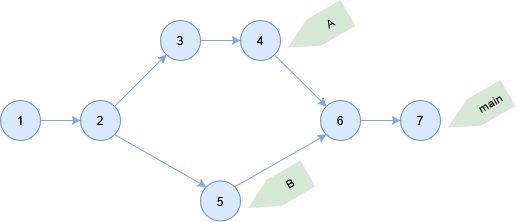
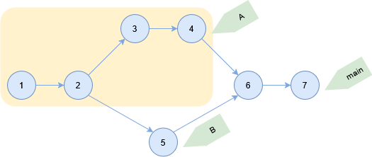
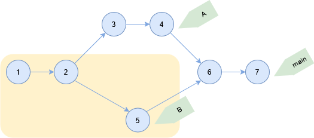
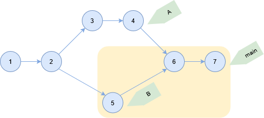
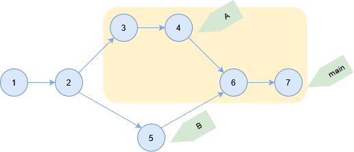
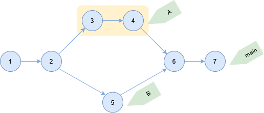
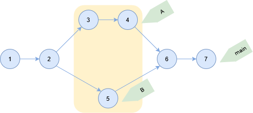

# log コマンド

コミット履歴を表示する。

```sh
git log
```

## ソースコード

- [builtin/log.c](https://github.com/git/git/blob/v2.47.1/builtin/log.c)

## 表示範囲

下記のコミットがある状態で HEAD は main ブランチとする。



### カレントコミット

引数を指定しない場合は現在の親コミットから辿ったログを表示する。

```sh
> git log --oneline
3d6320e (HEAD -> main) 7
a2e57f8 6
cb609e6 (B) 5
1f00ec0 (A) 4
ddb8418 3
3c7eeeb 2
538b83e 1
```

### 表示する参照を指定

コミットハッシュまたはブランチを指定する場合は、指定した参照から辿ったログを表示する。

ブランチ A から辿ったコミットを表示する。

```sh
> git log --oneline A
1f00ec0 (A) 4
ddb8418 3
3c7eeeb 2
538b83e 1
```



ブランチ B から辿ったコミットを表示する。

```sh
> git log --oneline B
cb609e6 (B) 5
3c7eeeb 2
538b83e 1
```



### 表示から除外する参照を指定

`^REF` から到達可能なコミットを除外する。
除外する境界のバウンダリーコミットを表示する場合は `--boundary` オプションを指定する。

main ブランチに含まれていて A ブランチに含まれていないコミットを表示する。

```sh
> git log --oneline main ^A
3d6320e (HEAD -> main) 7
a2e57f8 6
cb609e6 (B) 5
```



main ブランチに含まれていて B ブランチに含まれていないコミットを表示する。

```sh
> git log --oneline main ^B
3d6320e (HEAD -> main) 7
a2e57f8 6
1f00ec0 (A) 4
ddb8418 3
```



A ブランチに含まれていて B ブランチに含まれていないコミットを表示する。

```sh
> git log --oneline A ^B
1f00ec0 (A) 4
ddb8418 3
```



2 つの参照の場合は下記の形式は同じ意味になる。

```sh
> git log --oneline B..A
1f00ec0 (A) 4
ddb8418 3
```

A と B ブランチに含まれていて A と B の両方に含まれないコミットを表示する。

```sh
> git log --oneline A B ^3c7eeeb
cb609e6 (B) 5
1f00ec0 (A) 4
ddb8418 3
```



2 つの参照の場合は下記の形式は同じ意味になる。

```sh
> git log --oneline A...B
cb609e6 (B) 5
1f00ec0 (A) 4
ddb8418 3
```

### 親コミットを指定

`REF~` で `REF` の親コミットを指定する。

`~` を複数指定してさらに親コミットを指定できる。`~N` の形式で数字も指定できる。

HEAD の親コミットを指定する。

```sh
> git log --oneline HEAD~
a2e57f8 6
cb609e6 (B) 5
1f00ec0 (A) 4
ddb8418 3
3c7eeeb 2
538b83e 1
```

さらに親コミットを指定する。親は第 1 親を辿る。

```sh
> git log --oneline HEAD~~
1f00ec0 (A) 4
ddb8418 3
3c7eeeb 2
538b83e 1
```

数字の形式で指定する。

```sh
> git log --oneline HEAD~2
1f00ec0 (A) 4
ddb8418 3
3c7eeeb 2
538b83e 1
```

`REF^` でマージコミットで親を選択できる。

`REF^` で第 1 親を辿る。

```sh
> git log --oneline HEAD~^
1f00ec0 (A) 4
ddb8418 3
3c7eeeb 2
538b83e 1
```

`REF^2` で第 2 親を辿る。

```sh
> git log --oneline HEAD~^2
cb609e6 (B) 5
3c7eeeb 2
538b83e 1
```

## コミットメッセージの検索

コミットメッセージに含まれる文字列を検索する。

```sh
> git log --oneline --grep 3
23959f3 (origin/main) 3
```

## 更新内容の検索

変更内容に含まれる文字列を検索する。

```sh
> git log --oneline -S 3
```
