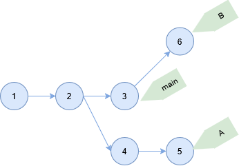
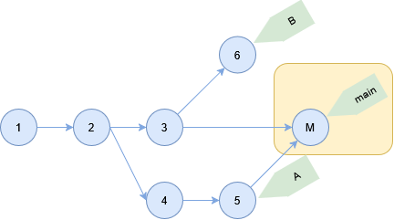
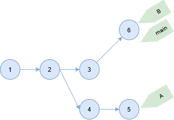
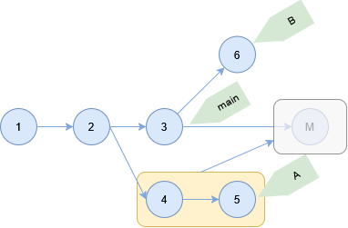

# merge コマンド

別のブランチをカレントブランチに結合する。

```sh
git merge
```

## ソースコード

- [builtin/merge.c](https://github.com/git/git/blob/v2.47.1/builtin/merge.c)

## マージの種類

下記のコミットがある状態で HEAD は main ブランチとする。



### マージコミット

マージコミットを作成する。

```sh
> git merge A
Merge made by the 'ort' strategy.

> git log --oneline
ac2f847 (HEAD -> main) Merge branch 'A'
7a1f9aa (origin/A, A) 5
6eeecbf 4
23959f3 (origin/main) 3
4b7da5d 2
98c1ffa 1

> git cat-file -p ac2f847e7c58b4501ffe9813b9bb59ed423e6f7c
tree 4b825dc642cb6eb9a060e54bf8d69288fbee4904
parent 23959f3e1e72aa8598d4c8b0126a37e17dd2093a
parent 7a1f9aab9ba98bc487a30becd7c663196f125077
author root <root@home.local> 1743678616 +0900
committer root <root@home.local> 1743678616 +0900

Merge branch 'A'
```



### Fast Forward

カレントブランチヘッドを移動する。

```sh
> git merge --ff-only B
Updating 23959f3..fef869e
Fast-forward

> git log --oneline
fef869e (HEAD -> main, origin/HEAD, origin/B, B) 6
23959f3 (origin/main) 3
4b7da5d 2
98c1ffa 1

> git cat-file -p fef869e7ffefd212875386c58ad76860cea3c893
tree 4b825dc642cb6eb9a060e54bf8d69288fbee4904
parent 23959f3e1e72aa8598d4c8b0126a37e17dd2093a
author root <root@home.local> 1743678411 +0900
committer root <root@home.local> 1743678411 +0900

6
```



Fast Forward できない場合はエラーになる。

```sh
> git merge --ff-only A
hint: Diverging branches can't be fast-forwarded, you need to either:
hint:
hint:   git merge --no-ff
hint:
hint: or:
hint:
hint:   git rebase
hint:
hint: Disable this message with "git config advice.diverging false"
fatal: Not possible to fast-forward, aborting.
```

### Squash

マージするブランチのコミットを 1 つにまとめる。
ただし、コミットは作成されずインデックスにステージングされた状態となる。

```sh
> git merge --squash A
Squash commit -- not updating HEAD
Automatic merge went well; stopped before committing as requested

> git status --short
A  README.md

> git log --oneline
23959f3 (HEAD -> main, origin/main) 3
4b7da5d 2
98c1ffa 1
```



## 複数ブランチのマージ

複数のブランチをマージする。

```sh
> git merge --no-ff A B
Trying simple merge with A
Trying simple merge with B
Merge made by the 'octopus' strategy.

> git log --oneline
12f37e7 (HEAD -> main) Merge branches 'A' and 'B'
fef869e (origin/HEAD, origin/B, B) 6
7a1f9aa (origin/A, A) 5
6eeecbf 4
23959f3 (origin/main) 3
4b7da5d 2
98c1ffa 1

> git cat-file -p 12f37e7c5d25b4f98c1b5e97d19553acb2c8d3aa
tree 4b825dc642cb6eb9a060e54bf8d69288fbee4904
parent 23959f3e1e72aa8598d4c8b0126a37e17dd2093a
parent 7a1f9aab9ba98bc487a30becd7c663196f125077
parent fef869e7ffefd212875386c58ad76860cea3c893
author root <root@home.local> 1743680220 +0900
committer root <root@home.local> 1743680220 +0900

Merge branches 'A' and 'B'
```


親コミットは `REF^` で参照できる。

```sh
> git show HEAD^1
commit 23959f3e1e72aa8598d4c8b0126a37e17dd2093a (origin/main)
Author: root <root@home.local>
Date:   Thu Apr 3 20:04:19 2025 +0900

    3

> git show HEAD^2
commit 7a1f9aab9ba98bc487a30becd7c663196f125077 (origin/A, A)
Author: root <root@home.local>
Date:   Thu Apr 3 20:04:52 2025 +0900

    5

> git show HEAD^3
commit fef869e7ffefd212875386c58ad76860cea3c893 (origin/HEAD, origin/B, B)
Author: root <root@home.local>
Date:   Thu Apr 3 20:06:51 2025 +0900

    6
```
