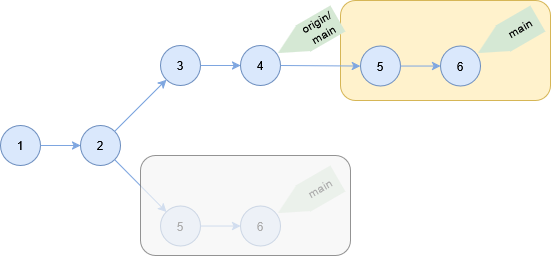
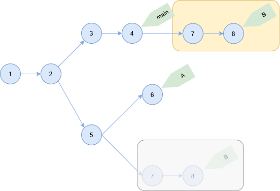

# rebase コマンド

ブランチを別のブランチに再適用する。

```sh
git rebase [アップストリーム] [ブランチ]
```

アップストリームを指定しない場合は追跡しているブランチとなる。

ブランチを指定しない場合はカレントブランチを対象にする。
指定する場合は [git switch](./git-switch.md) コマンドでブランチが変更される。

再適用するコミットは `アップストリーム..ブランチ` のコミットになる。

適用先のブランチはアップストリームまたは `--onto` オプションで指定したブランチとなる。

## ソースコード

- [builtin/rebase.c](https://github.com/git/git/blob/v2.47.1/builtin/rebase.c)

## トラッキングブランチに適用

トラッキングブランチに適用する。

```sh
> git rabase
Successfully rebased and updated refs/heads/main.

> git log --oneline
bb0bda3 (HEAD -> main) 6
7d51ae8 5
b5a32e4 (origin/main, origin/HEAD) 4
8f278ed 3
bf44e6a 2
19ad274 1
```

`origin/main` に対して `main` ブランチが再適用される。



## 一部のコミットをブランチに適用

特定のブランチにあるコミットを指定して再適用する。

```sh
> git rebase --onto main A B
Successfully rebased and updated refs/heads/B.

> git log --oneline
7291d8e (HEAD -> B) 8
7a39afe 7
68e59f8 (main) 4
fe74a14 3
f83c631 2
13aa8dc 1
```

main ブランチに `A..B` コミットが適用される。


