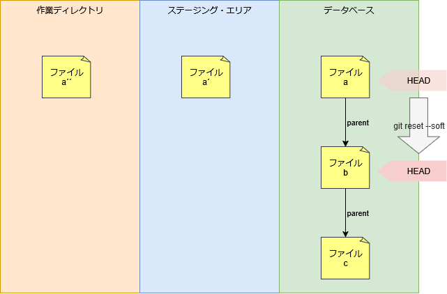
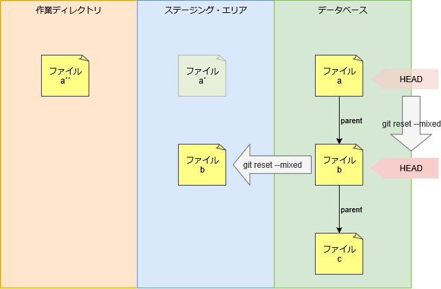
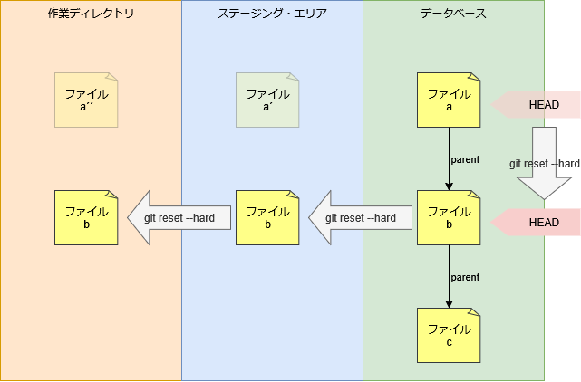

# reset コマンド

[ファイルの状態](../concept/status.md) をも度に戻す。

```sh
git reset
```

オプションによって戻す対象を変更できる。

| オプション         | 対象                                         |
| :----------------- | :------------------------------------------- |
| `--soft`           | HEAD                                         |
| `--mixed` (既定値) | HEAD, ステージング・エリア                   |
| `--hard`           | HEAD, ステージング・エリア、作業ディレクトリ |

## ソースコード

- [builtin/reset.c](https://github.com/git/git/blob/v2.47.1/builtin/reset.c)

## コミットの状態に戻す

現在の状態を確認する。

```sh
> git log -3 --oneline --graph
* fb7363a (HEAD -> A) 7
* 6529e92 5
* 6eeecbf 4

> git status --short
MM README.md

> git diff
diff --git a/README.md b/README.md
index 45a4fb7..ec63514 100644
--- a/README.md
+++ b/README.md
@@ -1 +1 @@
-8
+9

> git diff --staged
diff --git a/README.md b/README.md
index 7f8f011..45a4fb7 100644
--- a/README.md
+++ b/README.md
@@ -1 +1 @@
-7
+8

> git show --oneline -p
fb7363a (HEAD -> A) 7
diff --git a/README.md b/README.md
index e69de29..7f8f011 100644
--- a/README.md
+++ b/README.md
@@ -0,0 +1 @@
+7
```

### `--soft`

HEAD の位置を変更する。

```sh
> git reset --soft HEAD~1
```

状態を確認する。
HEAD が HEAD~1 の状態に戻る。

```sh
> git log -1 --oneline
6529e92 (HEAD -> A) 5

> git status --short
MM README.md

> git diff
diff --git a/README.md b/README.md
index 45a4fb7..ec63514 100644
--- a/README.md
+++ b/README.md
@@ -1 +1 @@
-8
+9

> git diff --staged
diff --git a/README.md b/README.md
index e69de29..45a4fb7 100644
--- a/README.md
+++ b/README.md
@@ -0,0 +1 @@
+8
```



### `--mixed`

HEAD とステージングエリアを変更する。

```sh
> git reset --mixed HEAD~1
Unstaged changes after reset:
M       README.md
```

状態を確認する。
HEAD とステージング・エリアが HEAD~1 の状態に戻る。

```sh
> git log -1 --oneline
6529e92 (HEAD -> A) 5

> git status --short
 M README.md

> git diff
diff --git a/README.md b/README.md
index e69de29..ec63514 100644
--- a/README.md
+++ b/README.md
@@ -0,0 +1 @@
+9
```



### `--hard`

HEAD とステージングエリア、作業ディレクトリを変更する。

```sh
> git reset --hard HEAD~1
HEAD is now at 6529e92 5
```

状態を確認する。
HEAD とステージング・エリアと作業ディレクトリが HEAD~1 の状態に戻る。

```sh
> git log -1 --oneline
6529e92 (HEAD -> A) 5

> git status --short
```



## 指定したファイルの状態を戻す

```{note}
* ファイルを指定した場合は HEAD は変更されない。
* `--hard` オプションの指定はできない。
```

ステージングエリアのファイルを指定したコミット状態に戻す。

```sh
> git reset HEAD~1 README.md
Unstaged changes after reset:
M       README.md
```

状態を確認する。
ステージング・エリアが HEAD~1 の状態に戻る。

```sh
> git log -1 --oneline
fb7363a (HEAD -> A) 7

> git status --short
MM README.md

> git diff
diff --git a/README.md b/README.md
index e69de29..ec63514 100644
--- a/README.md
+++ b/README.md
@@ -0,0 +1 @@
+9

> git diff --staged
diff --git a/README.md b/README.md
index 7f8f011..e69de29 100644
--- a/README.md
+++ b/README.md
@@ -1 +0,0 @@
-7
```
