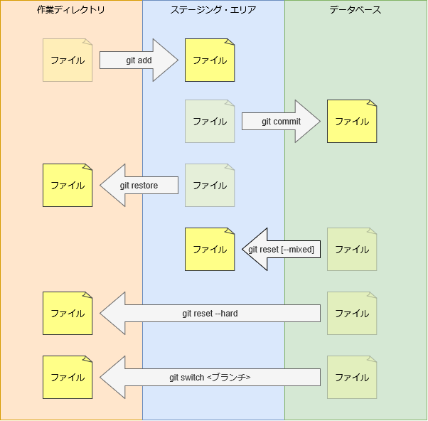
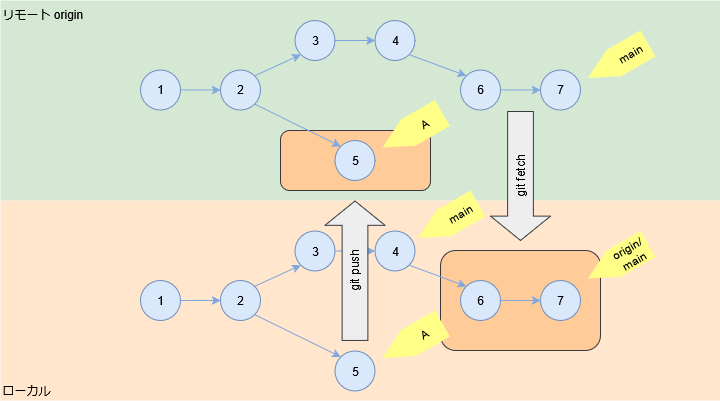

# ファイルの状態

## ローカルリポジトリ

ローカルのリポジトリで管理しているファイルは 3 つの領域に格納される。

- 作業ディレクトリ
  - [git add](../command/git-add.md) を使用してファイルをステージング済みに更新する。
- ステージング・エリアまたはインデックス
  - [git commit](../command/git-commit.md) を使用してファイルをコミット済みに更新する。
  - [git restore](../command/git-restore.md) を使用してファイルをステージング済み状態に戻す。
- データベース
  - ファイルを編集すると編集済みに更新する。
  - [git reset](../command/git-reset.md) を使用してステージング・エリアのファイルをコミット状態に戻す。
  - [git reset --hard](../command/git-reset.md) を使用してファイルをコミット状態に戻す。
  - [git switch](../command/git-switch.md) を使用してファイルを別ブランチのコミット状態に戻す。

## アップストリームリポジトリ

ローカルリポジトリとアップストリームリポジトリでブランチを同期する。

- [git push](../command/git-push.md) を使用してローカルブランチでアップストリームリポジトリのブランチを作成および更新する。
- [git fetch](../command/git-fetch.md) を使用してアップストリームリポジトリのブランチを取得してリモートトラッキングブランチを更新する。

